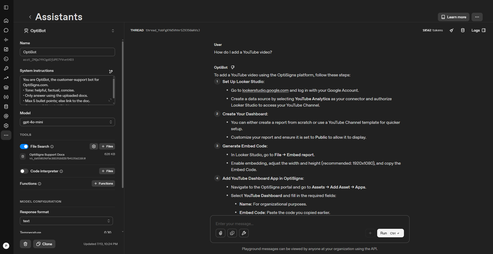

# OptiBot Mini-Clone

Daily pipeline that scrapes [OptiSigns Help Center](https://support.optisigns.com) articles, uploads them to an OpenAI Vector Store, and powers an AI support assistant — all automated via Docker + cron.

```
Zendesk API → scrape HTML → clean Markdown → SHA-256 delta → upload only changes → AI Assistant
     │                                                           │
     └─────────────────── runs daily at 3 AM UTC ────────────────┘
```

---

## Setup

```bash
git clone <this-repo>
cd <repo>
cp .env.sample .env
# Edit .env — add your OpenAI API key from https://platform.openai.com/api-keys
pip install -r requirements.txt
```

**Requirements:** Python 3.12+, or Docker.

---

## Run Locally

```bash
# One-shot pipeline (scrape → detect changes → upload delta → exit)
python main.py
```

```bash
# Docker (no Python needed)
docker build -t optibot-clone .
docker run --rm -e OPENAI_API_KEY=sk-... optibot-clone
```

Expected output:

```
📡 DISCOVER: Found 35 articles
📊 ETL Summary: added: 0 | updated: 1 | skipped: 34
📊 Delta Upload Summary: 1 file(s) uploaded
Pipeline Complete! exit 0 ✅
```

Test the assistant at: https://platform.openai.com/playground/assistants

---

## How It Works

| Layer           | What                                                         | File          |
| --------------- | ------------------------------------------------------------ | ------------- |
| **Scrape**      | Zendesk API → HTML → strip nav/ads → Markdown                | `scraper.py`  |
| **Detect**      | SHA-256 hash comparison against `articles/scrape_state.json` | `scraper.py`  |
| **Upload**      | Only new/changed files → OpenAI Vector Store                 | `uploader.py` |
| **Orchestrate** | 3-path flow: first run / no changes / delta upload           | `main.py`     |
| **Deploy**      | Docker image → Railway cron (`0 3 * * *`)                    | `Dockerfile`  |

### Chunking Strategy

OpenAI's built-in recursive text splitter (~800 tokens/chunk, ~400 token overlap). Splits respect Markdown structure (prefers heading/paragraph boundaries). No custom chunking — the managed Vector Store handles embedding + indexing automatically. [Learn more →](https://platform.openai.com/docs/guides/agents)

### Delta Detection

Each article's content is SHA-256 hashed. On every run, hashes are compared against the previous run's state. Only articles with new IDs or changed hashes are uploaded — typically 0–3 per day. The state file lives in `articles/scrape_state.json` (persisted via Docker volume).

---

## Deployment

Deployed on [Railway](https://railway.app) with a daily cron trigger (`0 3 * * *` UTC).

- **Job logs:** [Railway Deploy Logs](https://railway.com/project/38732383-82c5-485a-bc6a-f867972bf60c/service/275e03a4-7d81-4de1-bee6-e8507fd5f725?environmentId=88c811c7-c6d1-40ed-9439-fc4763f732b4&id=6d373bd1-7df5-4902-8a1b-e4009eb71c03#details)
- **Docker:** `docker run --rm -e OPENAI_API_KEY=sk-... optibot-clone` exits 0 on success

---

## Screenshot

> 

---

## Tech Stack

Python · BeautifulSoup · html2text · OpenAI Assistants API v2 · Docker · Railway Cron
